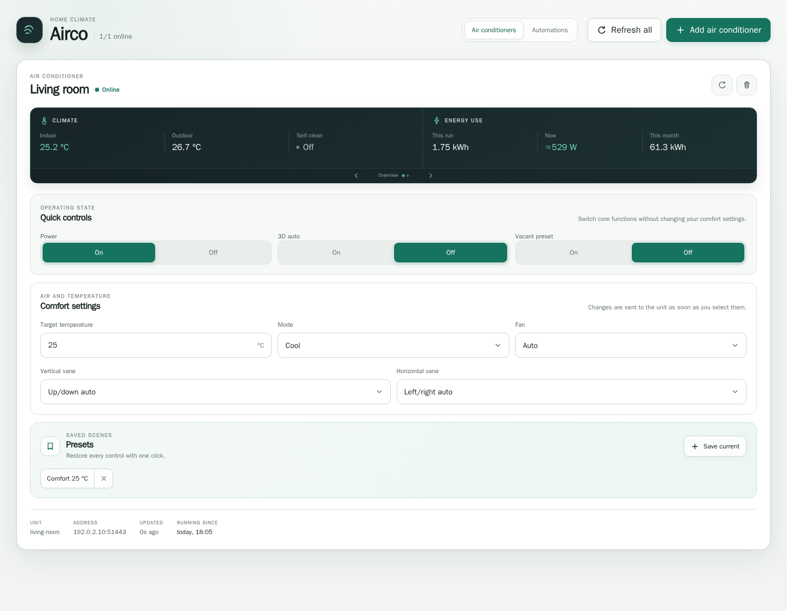
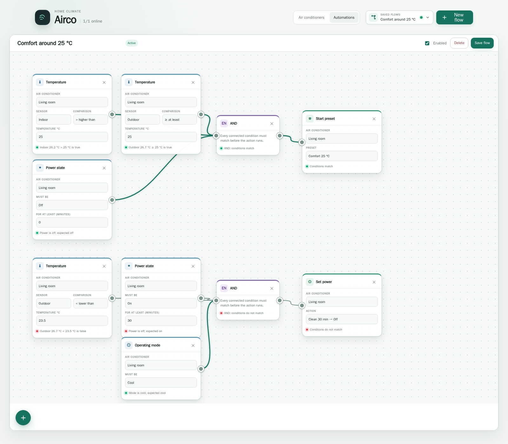

> **Note on this fork:** This fork changes default communication to plain **HTTP** instead of HTTPS for WF-RAC Wi-Fi modules operating on port 51443. This resolves `EPROTO wrong version number` / SSL handshake errors when discovering or controlling units.

# AircoBridge

[](https://github.com/CrazyHenk44/AircoBridge/releases/latest)
[](https://github.com/CrazyHenk44/AircoBridge/actions/workflows/ci.yml)
[](https://github.com/CrazyHenk44/AircoBridge/pkgs/container/aircobridge)

**Control and automate Mitsubishi Heavy Industries air conditioners directly on your
LAN — without a cloud account, subscription or external automation platform.**

AircoBridge connects to Smart M-Air / WF-RAC Wi-Fi modules and gives you a polished web
dashboard, visual climate automations, live energy insight and a documented REST API.
Everything runs locally, including your automations.



## Why AircoBridge?

| Local by design | Useful automations | More insight |
| --- | --- | --- |
| Talks directly to the air conditioner. No manufacturer cloud or internet connection required. | Build flows visually from temperature, power, mode and time conditions. They keep running when the browser is closed. | See temperatures, energy history and estimated live outdoor-unit power, plus compressor and coil telemetry. |

### Highlights

- Control power, temperature, mode, fan speed, vanes, 3D auto and vacant mode.
- Save named presets and apply a complete configuration with one click.
- Start with a ready-made temperature-control template or create a flow from scratch.
- Combine conditions with AND/OR blocks and connect them to preset or power actions.
- Require a power state to have lasted for a minimum time before an action may run.
- Finish cooling with a managed **Clean 30 min → Off** cycle.
- Keep manual control in charge until the unit is switched off or automations are resumed.
- Review a local activity log explaining triggers, skipped actions and errors.
- Discover compatible units through mDNS and follow later IP-address changes.
- Integrate other local systems through the JSON REST API and `_aircobridge._tcp.local`.

## Quick start

You need Docker with the Compose plugin and an air conditioner already connected to
Wi-Fi through the Smart M-Air app. The published image supports AMD64 and ARM64 Linux.

```sh
git clone https://github.com/CrazyHenk44/AircoBridge.git
cd AircoBridge
make setup
docker compose up -d
```

Open [http://localhost:3000](http://localhost:3000), click **Add air conditioner** and
follow the setup wizard. It can discover a unit automatically, register the bridge on
the Wi-Fi module, test the connection and save the configuration.

To install a newer release later:

```sh
make update
```

Configuration and runtime data live in the mounted `config/` and `data/` directories,
so recreating or updating the container keeps your units, presets, history and flows.

## Visual automations

Open **Automations** to create a blank flow or choose **+ → Templates → Temperature
control**. The template creates guarded start and stop branches that you can edit like
any other flow.

By default, it:

1. Starts a selected preset when the temperature conditions match and the unit is off.
2. Prevents the stop branch from running until the air conditioner has been on for at
   least 30 minutes.
3. Runs a 30-minute low-fan Clean cycle before switching the unit off.



Flows and their latest 500 meaningful activity events are stored locally. Manual
changes made through the dashboard or physical remote pause automation actions for
that unit; switching it off or selecting **Resume automations** hands control back.

## Compatible hardware

AircoBridge targets Mitsubishi Heavy Industries units fitted with a **WF-RAC** or
**WF-RAC-HTTPS** module — the modules used by the Smart M-Air mobile app. It connects to
the local Beaver API on port `51443`.

Currently verified hardware:

| Indoor unit | Wi-Fi module | Wireless firmware | MCU firmware |
| --- | --- | --- | --- |
| SRK50ZS-WF | WF-RAC-HTTPS | 025 | 200 |

Other WF-RAC models are likely compatible because they share the protocol. Reports for
other combinations are welcome; please include the model and firmware versions but no
device identifiers or credentials.

## REST API

Everything in the dashboard uses the same JSON API that is available to your own local
integrations:

```sh
curl -X POST http://localhost:3000/api/aircos/living-room/power \
  -H 'content-type: application/json' \
  -d '{"power":"on"}'
```

See [docs/api.md](docs/api.md) for air-conditioner controls, presets, automations,
activity logs and feature detection.

## Troubleshooting

A unit normally appears online within one polling interval (30 seconds by default).
Start with:

```sh
docker compose ps
docker compose logs -f airco
curl -s http://localhost:3000/api/aircos
```

Connection problems are usually caused by VLAN isolation, blocked mDNS traffic, an
incorrect address or unavailable operator slot. Manual configuration, network-interface
selection, registration and Docker Desktop notes are covered in
[docs/advanced.md](docs/advanced.md).

## Documentation

- [API reference](docs/api.md) — controls, presets, automations and integration details.
- [Advanced setup](docs/advanced.md) — configuration, networking, CLI and debugging.
- [Architecture](docs/architecture.md) — service components and persistent state.
- [WF-RAC protocol notes](docs/mitsubishi-airco.md) — Beaver messages and operation data.

## Security

AircoBridge has no built-in user authentication and communicates with the module over
its self-signed TLS connection. Run it only on a trusted LAN and never expose port
`3000` directly to the internet. See [SECURITY.md](SECURITY.md) for the threat model and
reporting process.

## Contributing

Compatibility reports, bug reports and pull requests are welcome. See
[CONTRIBUTING.md](CONTRIBUTING.md) for the contribution workflow and required checks.

## Credits

Protocol knowledge builds on the reverse-engineering work of
[jeatheak/Mitsubishi-WF-RAC-Integration](https://github.com/jeatheak/Mitsubishi-WF-RAC-Integration),
[JobDoesburg/homebridge-mhi-wfrac](https://github.com/JobDoesburg/homebridge-mhi-wfrac)
and [mcheijink/WF-RAC](https://github.com/mcheijink/WF-RAC).

## License

[MIT](LICENSE)
